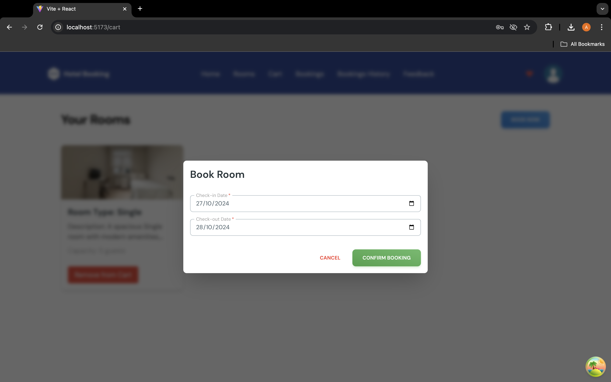
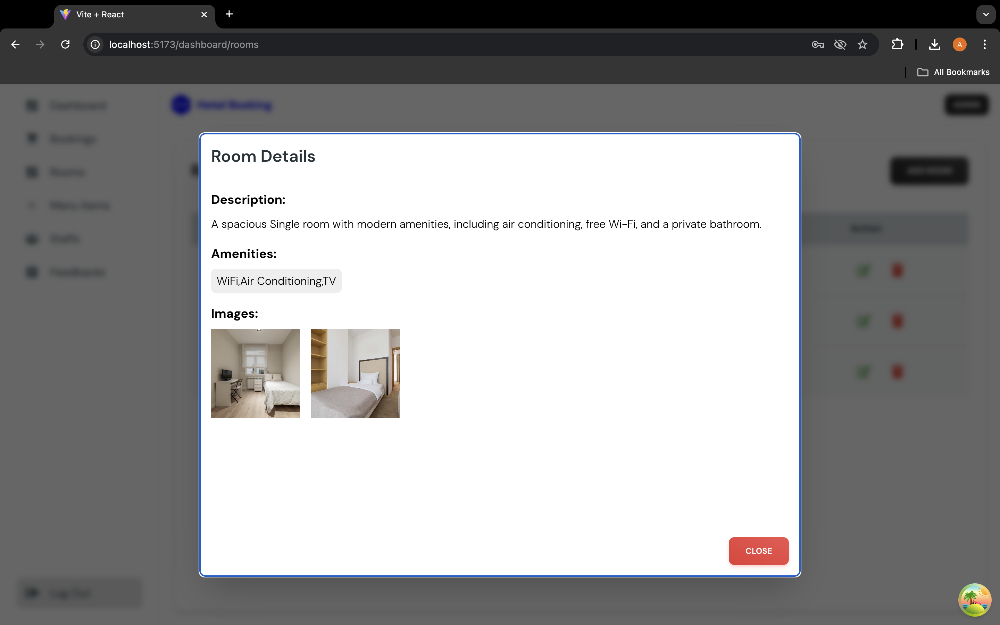
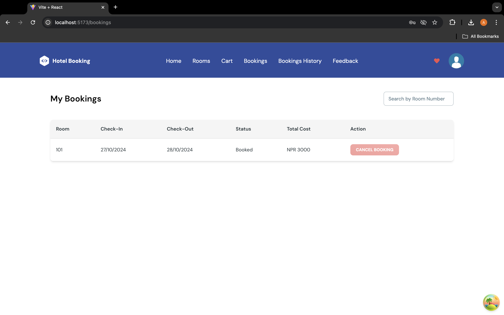

# Hotel Booking Management Portal

This project is a web-based platform for efficiently managing hotel operations, including room bookings, food orders, guest check-ins/check-outs, staff management, and hotel analytics. The platform features an intuitive interface for both administrators and users, providing real-time insights and seamless interactions.

## Key Features

### 1. **Room and Guest Management**
- Manage rooms, including adding, editing, and viewing available rooms.
- Track guest check-ins and check-outs with accurate record-keeping.
- Implemented a room booking system with **date validation** to avoid overlapping bookings.
- Users can extend their stay directly through the platform.

### 2. **Menu and Food Order Management**
- Create, update, and delete food menu items, including appetizers, main courses, desserts, beverages, and sides.
- Track food orders placed by guests and manage order fulfillment.
  
### 3. **Staff Management**
- Manage staff details, including adding new staff members, editing profiles, and assigning roles.
  
### 4. **Feedback and Reviews**
- Integrated user feedback system allowing guests to rate their bookings and leave reviews.
- Feedback and ratings are displayed to help improve the overall guest experience.

### 5. **Admin Dashboard**
- A comprehensive **dashboard** with various charts and **analytics** to monitor hotel performance.
- Daily, weekly, and monthly performance reports on bookings, room occupancy, and sales.
  
### 6. **Booking History and Transaction Details**
- Users can view their **booking history**, including past reservations and detailed transaction records.

## Technology Stack

- **Frontend:** React.js
- **Backend:** Node.js, Express.js
- **Database:** MongoDB
- **Styling:** Tailwind CSS
- **Deployment:** Firebase for image storage, Heroku for backend deployment
- **Data Management:** Utilized Mongoose for managing MongoDB database operations

## Screenshots

